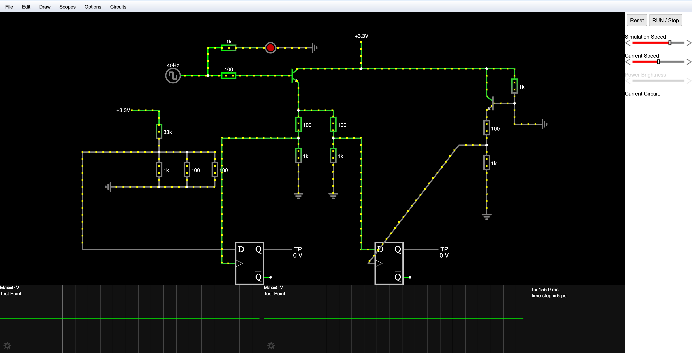
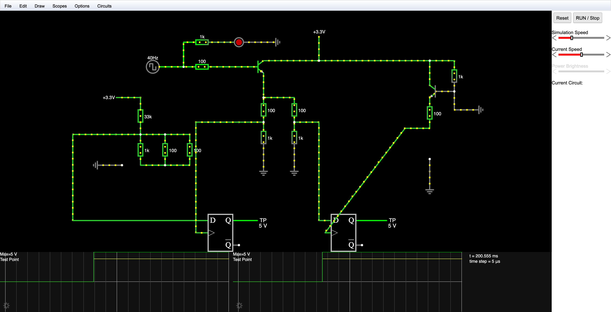
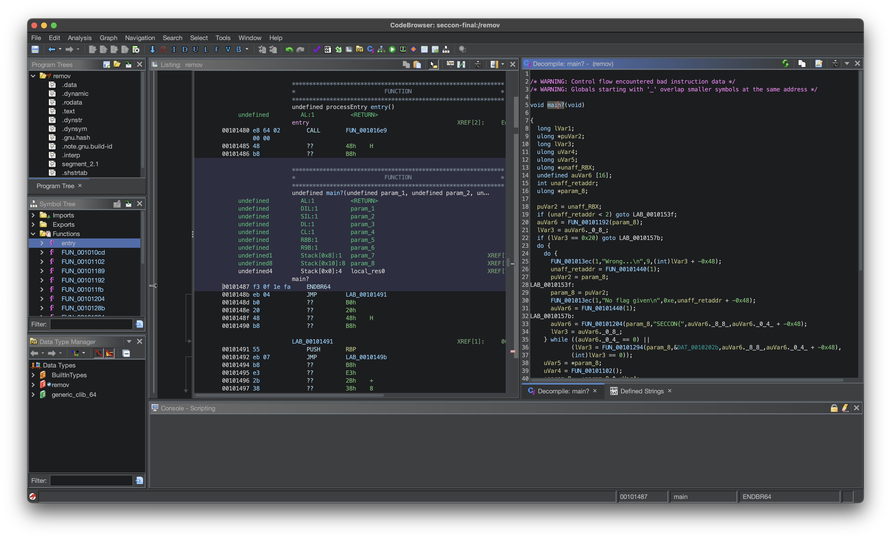

# SECCON CTF 2023 Final Writeup

[日本語の writeup はここ。](./README.md)

# About Contest

CTFtime.org: <https://ctftime.org/event/2160>

# Environment Software

Dynabook GZ/HW, with Ubuntu Mate VM on VirtualBox. Windows VM and Ubuntu VM remotely is also used.

Used softwares include [Ghidra](https://ghidra-sre.org/) (+ [ret-sync](https://github.com/bootleg/ret-sync)), [WinDbg Preview](https://apps.microsoft.com/detail/9PGJGD53TN86?hl=ja-jp&gl=JP), [ImHex](https://github.com/WerWolv/ImHex) and [Falstad Circuit Simulator](https://www.falstad.com/circuit/).

# Solved Problems

## digicake (misc)

This is the first problem we solved. We had one hour to prepare and 10 minutes to cut connections with the [MISUMI soldering set H-740](https://jp.misumi-ec.com/vona2/detail/222000167381/) and make GP18 and GP19 high. [Rule sheet](https://bitbucket.org/ptr-yudai/writeups-2023/src/master/SECCON_CTF_Finals/misc/digicake/build/rule.pdf?at=b0701b6dfdba563d81e16e10ef865501737fbf1b), [circuit diagram](https://bitbucket.org/ptr-yudai/writeups-2023/src/master/SECCON_CTF_Finals/misc/digicake/build/digicake-v1-prod-circuit.pdf?at=b0701b6dfdba563d81e16e10ef865501737fbf1b) and [source code of the firmware](https://bitbucket.org/ptr-yudai/writeups-2023/src/master/SECCON_CTF_Finals/misc/digicake/build/digicake.c?at=b0701b6dfdba563d81e16e10ef865501737fbf1b) is available.

Even though I had learnt about NPN transistors, I had forgotten most of what I learnt, so we ran the circuit in [Falstad Circuit Simulator](https://www.falstad.com/circuit/).



We threw things on the wall and saw what stuck. We did make both GP18 and GP19 high in the simulator. After entering the room, we discovered that we don't actually have to cut the +3.3V on top which we intended to, which was good news as it was annoying to cut.



We would have certainly not solved this problem without this simulator, so thanks.

## babywaf (web)

[ciffelia](https://twitter.com/ciffelia) was solving this at the beginning, but I got stuck solving remov so I tried as well as a change of mood.

```
[15:14] 先頭が`{`か`{`じゃないとエラー吐く
(Error is thrown if the body does not start with `{` or `[`)

[15:15] fastifyのほうのpreValidationはtypeof req.body === 'object' ? req.body : JSON.parse(req.body)が怪しい
(preValidation in fastify being typeof req.body === 'object' ? req.body : JSON.parse(req.body) seems strange)

[15:15] JSONはfaistifyがパースしてくれるからわざわざJSON.parseを書く必要はないはず
(since fastify parses JSON, there should be no need to write JSON.parse)
```

Since `express.json` simply exports `json` from `body-parser`, I decided to read the source code of `body-parser` and discovered that it uses `iconv-lite`. Maybe the problem is related to text encoding...? and so I tried sending JSON body with BOM and it worked. Sorry for solving the problem in a strange way...

Reading the flag properly, section 8.1 of RFC 8259 is mentioned, the content being

> In the interests of interoperability, implementations that parse JSON texts MAY ignore the presence of a byte order mark rather than treating it as an error.

Aha.

## remov (rev)

This is the first reversing problem we solved.

First we read the `entry` function.

```
                             undefined processEntry entry()
             undefined         AL:1           <RETURN>
                             entry                                           XREF[2]:     Entry Point(*), 00100018(*)
        00101480 e8 64 02        CALL       FUN_001016e9                                     undefined FUN_001016e9()
                 00 00
        00101485 48 b8 f3        MOV        RAX,0x20b004ebfa1e0ff3
                 0f 1e fa
                 eb 04 b0 20
        0010148f 48 b8 55        MOV        RAX,-0x5cc7d41c47f814ab
                 eb 07 b8
                 e3 2b 38 a3
```

Then we read `FUN_001016e9`.

```
                             **************************************************************
                             *                          FUNCTION                          *
                             **************************************************************
                             undefined FUN_001016e9()
             undefined         AL:1           <RETURN>
                             FUN_001016e9                                    XREF[1]:     entry:00101480(c)
        001016e9 58              POP        RAX
        001016ea 48 ff c0        INC        RAX
        001016ed 48 ff c0        INC        RAX
        001016f0 50              PUSH       RAX
        001016f1 c3              RET
```

which means that `CALL FUN_001016e9` returns to `00104087`.

Since a `MOV` instrucion is already disassembled at `00104085`, we select the block of all `MOV` instructions and press <kbd>c</kbd> (Clear Code Bytes). Then we select `00104087` and press <kbd>F11</kbd> (Disassemble 64-bit x86), and finally <kbd>F</kbd> (Create Function) and the decompile result pops out.



Then we simply see what the program is doing. Each 8 bytes is xored with a fixed value and the correct result is embedded in the binary, so we simply need to extrcat the fixed value used in the xor operation.

While reading the [source code](https://bitbucket.org/ptr-yudai/writeups-2023/src/master/SECCON_CTF_Finals/reversing/remov/build/main.c?at=b0701b6dfdba563d81e16e10ef865501737fbf1b), I finally discovered that anti-debugging measures is implemented in the program, while I have tried to solve the problem using `gdb` during the contest...

## efsbk (rev)

When I saw the filename `efsbk.exe`, it reminded me that I haven't solved any Windows reversing problem before... but since I was the only person solving reversing problems, I decided to pick up WinDbg that night.

If we take a look at the important parts of the code,

<details><summary>main function</summary>

```cpp
  DAT_140005630 =
       CreateFileW(L"flag.bin",0x40000000,0,(LPSECURITY_ATTRIBUTES)0x0,2,0x80,(HANDLE)0x0);
  hCertStore = pCertContext;
  if (((DAT_140005630 != (HANDLE)0xffffffffffffffff) &&
      (DVar2 = OpenEncryptedFileRawW(L"flag.txt",0,&local_a8), DVar2 == 0)) &&
     (DVar2 = ReadEncryptedFileRaw((PFE_EXPORT_FUNC)&LAB_140001000,(PVOID)0x0,local_a8),
     pCertContext = (PCCERT_CONTEXT)0x0, hCertStore = (PCCERT_CONTEXT)0x0, DVar2 == 0)) {
    while (_DAT_140005628 == 0) {
      Sleep(1);
    }
    GetUserNameW(local_98,&local_a0);
    hCertStore = (PCCERT_CONTEXT)CertOpenSystemStoreW(0,L"MY");
    if (((hCertStore != (PCCERT_CONTEXT)0x0) &&
        (pCertContext = CertFindCertificateInStore
                                  (hCertStore,1,0,0x80007,local_98,(PCCERT_CONTEXT)0x0),
        pCertContext != (PCCERT_CONTEXT)0x0)) &&
       (BVar3 = PFXExportCertStoreEx(hCertStore,&local_b8,L"SECCON CTF 2023 Finals",(void *)0x0,7),
       BVar3 != 0)) {
      uVar1 = local_b8.cbData;
      pvVar4 = GetProcessHeap();
      pvVar5 = HeapAlloc(pvVar4,0,(ulonglong)uVar1);
      local_b8.pbData = (BYTE *)pvVar5;
      BVar3 = PFXExportCertStoreEx(hCertStore,&local_b8,L"SECCON CTF 2023 Finals",(void *)0x0,7);
      if (BVar3 != 0) {
        WriteFile(DAT_140005630,local_b8.pbData,local_b8.cbData,&local_9c,(LPOVERLAPPED)0x0);
      }
    }
  }
```

</details>

<details><summary>Callback function passed to <code>ReadEncryptedFileRaw</code></summary>

```cpp
  undefined auStackY_48 [32];
  DWORD aDStack_18 [2];
  ulonglong uStack_10;

  uStack_10 = DAT_140005008 ^ (ulonglong)auStackY_48;
  if (param_3 == 0) {
    _DAT_140005628 = 1;
    FUN_1400012e0(uStack_10 ^ (ulonglong)auStackY_48);
    return;
  }
  WriteFile(DAT_140005630,param_1,param_3,aDStack_18,(LPOVERLAPPED)0x0);
  FUN_1400012e0(uStack_10 ^ (ulonglong)auStackY_48);
  return;
```

</details>

We see that

- The first half of `flag.bin` is the file encrypted by EFS while the latter half is the key
- If we split the file, we can get the encrypted file and the key back

To ensure that the understanding is correct, I wanted to try running `efsbk.exe`, so I ran it with Ghidra + WinDbg + ret-sync. For some reasons the file kept being 0 KB, which the reason happens to be that the program doesn't work without running it as administrator. When the program is run is administrator, the file is generated correctly. Also, EFS seems to be not supported on Windows 11 Home.

To split the file, we need to know the boundary between the file and the key. Running `efsbk.exe` twice, and during the second run, we set a breakpoint at

```
       14000122f ff 15 4b        CALL       qword ptr [->KERNEL32.DLL::WriteFile]            = 00003cac
                 1e 00 00
```

and skip the instruction with `r @eip = @eip + 6`. We then see that the key starts with `30 82` and the boundary is probably `0x914` from the result of `grep` on `hexdump`. When we save the content of the latter half of the file as `flag.bin.pfx`, we see that the file can be correctly opened. The password is `SECCON CTF 2023 Finals` which is embedded in the binary.

Finally, we need to make sure the file is recognized as a file encrypted by EFS. We can do so by `OpenEncryptedFileRawW` and `WriteEncryptedFileRaw`, but it is easier to do so using [wlnx/rawcopy](https://github.com/wlnx/rawcopy), so it is used. Finally, we can open the file normally.

## okihai (rev)

At the beginning I just imported the binary into Ghidra, but [ciffelia](https://twitter.com/ciffelia) reminded me that there are a bunch of tools that can be used to convert Node.js programs into executables, so I searched and [vercel/pkg](https://github.com/vercel/pkg) came out.

Using [LockBlock-dev/pkg-unpacker](https://github.com/LockBlock-dev/pkg-unpacker), `okihai.js` is extracted succesfully, but it contains bytecode compiled using [`script.createCachedData()`](https://nodejs.org/api/vm.html#scriptcreatecacheddata) and there seems to be no working decomipler, so I tried to solve the problem using dynamic analysis not knowing whether it will work or not.

In order to perform dynamic analysis, there is a need to execute the bytecode. Since the bytecode is compiled using `script.createCachedData()`, I thought there would be an easy way to create a `Script` object from it, but it seems to be impossible unless patches from [vercel/pkg-fetch](https://github.com/vercel/pkg-fetch) is applied, so I changed the entrypoint of the application to the script below.

To explain what is happening, we wrapped the object returned from `require` into a `Proxy` object, also wrapping the return result of functions into `Proxy`s. This way we should be able to capture all function calls, giving us an overview into how the program works.

<details><summary>Actual script used</summary>

```js
const bytecode = `(omitted)`;
script = new (require("vm").Script)(undefined, {
  cachedData: Buffer.from(bytecode, "hex"),
  sourceless: true,
});
vm = require("vm");
crypto = require("crypto");

realflag = [
  43, 211, 195, 34, 90, 97, 59, 29, 159, 140, 40, 210, 178, 149, 103, 55, 119,
  125, 155, 96, 77, 2, 142, 54, 106, 223, 149, 206, 92, 17, 115, 152, 119, 72,
  36, 65, 13, 103, 137, 170, 94, 152, 237, 212, 136, 23, 17, 245, 45, 43, 4, 57,
  219, 135, 120, 212, 1, 35, 88, 186, 251, 186, 209, 63,
];
realflag2 = [];
realiv = [];
orig2 = undefined;
ttt = globalThis;
console.log(
  script.runInThisContext()(undefined, (x) => {
    y = require(x);
    function sproxy(s) {
      return new Proxy(
        {},
        {
          get(target, p, receiver) {
            console.log("stringaccess:", s, p);
            return typeof target[p] === "string"
              ? sproxy(target[p])
              : proxifier(target[p]);
          },
        }
      );
    }
    function proxifier(y) {
      if (typeof y === "string" || y instanceof String) {
        return sproxy(y);
      }
      if (typeof y !== "object" && typeof y !== "function") {
        return y;
      }
      return new Proxy(y, {
        set(obj, prop, value) {
          console.log("set", obj, prop, value);
          Reflect.set(...arguments);
        },
        get(target, prop, receiver) {
          res = target[prop];
          if (typeof res === "string") {
            return proxifier(res);
          }
          if (typeof res == "object" || Array.isArray(res)) {
            return proxifier(res);
          } else if (typeof res == "function") {
            return (...args) => {
              if (res?.toString() === "function valueOf() { [native code] }") {
                console.log("fncall", "valueOf", ...args);
                return res.bind(target);
              } else {
                pt =
                  target instanceof Buffer
                    ? `Buffer(${target.toString("hex")})`
                    : target.toString().slice(0, 50);
                console.log("fncall", pt, res, ...args);
              }
              if (typeof args[0] === "function") {
                orig = args[0];
                args[0] = (...args) => {
                  res = orig(...args.slice(0, 2));
                  res2 = orig(...args);
                  console.log(args, "->", res, res2);
                  if (target[0] === 0x58) {
                    realiv.push(res);
                  } else {
                    realflag2.push(res);
                  }
                  console.log(
                    "realiv",
                    Buffer.from(realiv).toString("hex"),
                    "realflag",
                    Buffer.from(realflag2).toString("hex")
                  );
                  return res;
                };
              }
              r = res.call(target, ...args);
              pr =
                r instanceof Buffer
                  ? `Buffer(${r.toString("hex")})`
                  : r.toString();
              console.log(
                "fncall",
                target?.toString().slice(0, 50),
                JSON.stringify(target),
                `[${target?.constructor?.toString()?.slice(0, 50)}]`,
                res,
                ...args,
                "is",
                pr
              );
              if (args?.[0] === "/snapshot/okihai/assets/flag") {
                //console.log(r);
                return proxifier(r);
              }
              // if (ArrayBuffer.isView(r))
              // return proxifier(Buffer.from(r));
              if (ArrayBuffer.isView(r)) {
                orig_ = r.map.bind(r);
                r.map = (...args) => {
                  console.log("MAP!!!!", args);
                  orig2 = args[0];
                  args[0] = (...args2) => {
                    let rr = orig2(...args2);
                    console.log(args2, "-->", rr);
                    return rr;
                  };
                  r3 = orig_(...args);
                  return proxifier(r3);
                };
                if (!r.hexslicebinded) {
                  r.hexslicebinded = true;
                  hsorig = r.hexSlice.bind(r);
                  r.hexSlice = (...args) => {
                    hsres = hsorig();
                    console.log(
                      r.toString(),
                      "hexSlice",
                      args,
                      "is",
                      hsres?.toString()
                    );
                    return proxifier(hsres);
                  };
                }
                return r;
              }
              if (typeof r === "string" || r.constructor === "string") {
                return r;
              }
              return proxifier(r);
            };
          } else {
            return res;
          }
        },
      });
    }
    return proxifier(y);
  })
);
rev = (s, i) => {
  for (let j = 0; j < 256; j++) {
    if (orig(j, i) == s) return j;
  }
  throw new Error("cannot rev");
};
rev2 = (s, i) => {
  for (let j = 0; j < 256; j++) {
    if (orig2(j, i) == s) return j;
  }
  throw new Error("cannot rev");
};
iv = Buffer.from("6f6b69686169215f6f6b696861692121", "hex");
realflag3 = Buffer.from(
  "2bd3c3225a613b1d9f8c28d2b2956737777d9b604d028e366adf95ce5c117398774824410d6789aa5e98edd4881711f52d2b0439db8778d4012358bafbbad13f",
  "hex"
);
for (let i = 0; i < 999; i++) {
  key = require("fs").readFileSync(`/snapshot/okihai/assets/${i}.key`);
  cipher = crypto.createDecipheriv("aes-256-cbc", key, iv);
  try {
    console.log(
      "init:",
      Buffer.from(realflag3),
      Buffer.from(realflag3).map((s, i) => rev2(s, i)),
      Buffer.from(realflag3).map((s, i) => rev(s, i))
    );
    first = cipher.update(Buffer.from(realflag3));
    // first=cipher.update(Buffer.from(realflag3).map((s,i)=>rev2(s,i)));
    console.log("final:", Buffer.concat([first, cipher.final()]).toString());
  } catch (err) {}
}
```

</details>

Running the above program and `grep SECCON` should give the flag.

# Comments

- Thanks to the reversing problems this time, I got to learn WinDbg which I have kept putting off.
- Want to upsolve call.
- Okihai is interesting, just wished there was an easy to use V8 bytecode decompiler...
