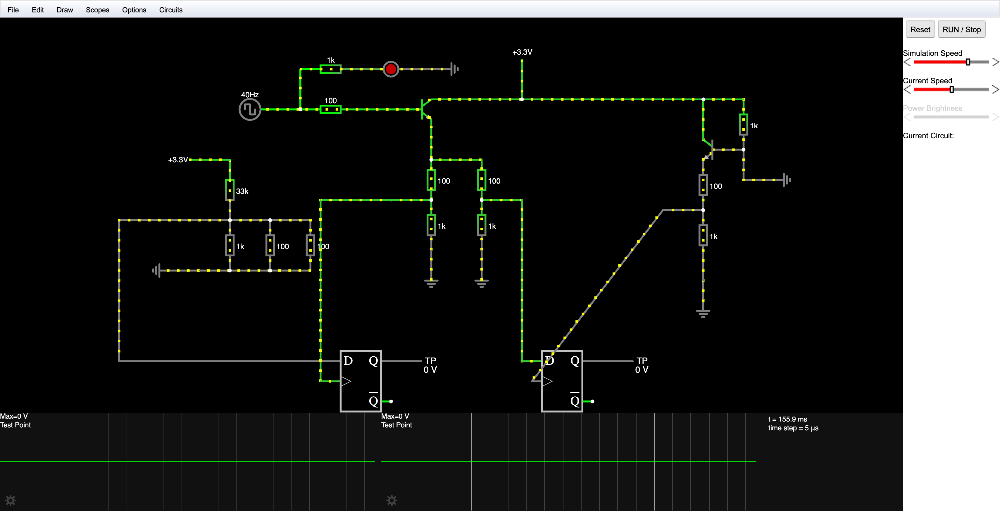

# SECCON CTF 2023 Final Writeup

[English writeup here.](./README.en.md)

# コンテストについて

CTFtime.org: <https://ctftime.org/event/2160>

# 環境・ソフトウェア

Dynabook GZ/HW の上に VirtualBox で Ubuntu Mate VM を構築した。自宅 PC 上の Windows VM と Ubuntu VM も使った。

使ったソフトウェアは、[Ghidra](https://ghidra-sre.org/) (+ [ret-sync](https://github.com/bootleg/ret-sync))、[WinDbg Preview](https://apps.microsoft.com/detail/9PGJGD53TN86?hl=ja-jp&gl=JP)、[ImHex](https://github.com/WerWolv/ImHex) および [Falstad Circuit Simulator](https://www.falstad.com/circuit/) だった。

# 解けた問題

## digicake (misc)

最初に解けた問題だった。1 時間の準備時間があって、10 分間で [MISUMI ソルダーセット H-740](https://jp.misumi-ec.com/vona2/detail/222000167381/) を使って接続を切って、GP18 および GP19 を high にする。[ルールシート](https://bitbucket.org/ptr-yudai/writeups-2023/src/master/SECCON_CTF_Finals/misc/digicake/build/rule.pdf?at=b0701b6dfdba563d81e16e10ef865501737fbf1b)、[回路図](https://bitbucket.org/ptr-yudai/writeups-2023/src/master/SECCON_CTF_Finals/misc/digicake/build/digicake-v1-prod-circuit.pdf?at=b0701b6dfdba563d81e16e10ef865501737fbf1b)と[ファームウェアのソースコード](https://bitbucket.org/ptr-yudai/writeups-2023/src/master/SECCON_CTF_Finals/misc/digicake/build/digicake.c?at=b0701b6dfdba563d81e16e10ef865501737fbf1b)がある。

NPN 型トランジスタについて電気電子回路入門で勉強したが、何も覚えてないのでとりあえず回路を前述した [Falstad Circuit Simulator](https://www.falstad.com/circuit/) で実行することにした。



適当に切ったら GP18 と GP19 両方 high になった。元々上の +3.3V も切るつもりだったが、部屋に入ってから切らなくても解けることに気づいたので切らなかった。


シミュレーターなかったら確実に解けなかった。ありがとう...

## babywaf (web)

最初は [ciffelia](https://twitter.com/ciffelia) さんが解いてた。remov を解けそうで解けなかったので気分転換で解いてみた。

```
[15:14] 先頭が`{`か`{`じゃないとエラー吐く
[15:15] fastifyのほうのpreValidationはtypeof req.body === 'object' ? req.body : JSON.parse(req.body)が怪しい
[15:15] JSONはfaistifyがパースしてくれるからわざわざJSON.parseを書く必要はないはず
```

`express.json` 実は `body-parser` の `json` を再エクスポートしているので、まず `body-parser` のソースコードを適当に読んでみたが、`iconv-lite` 使っていることに気づいて、もしかして文字エンコーディングと関係ある...？と思って BOM 付き UTF-8 投げてみたらフラグ取れたので終わり。適当に解いててすみません...

フラグの内容をちゃんと読んだら RFC 8259 の 8.1 について言及してて、調べてみたら

> In the interests of interoperability, implementations that parse JSON texts MAY ignore the presence of a byte order mark rather than treating it as an error.

と書いてあった。なるほど...

## remov (rev)

一番目に解いた reversing の問題だった。

`entry` 関数を見ると

```
                             undefined processEntry entry()
             undefined         AL:1           <RETURN>
                             entry                                           XREF[2]:     Entry Point(*), 00100018(*)
        00101480 e8 64 02        CALL       FUN_001016e9                                     undefined FUN_001016e9()
                 00 00
        00101485 48 b8 f3        MOV        RAX,0x20b004ebfa1e0ff3
                 0f 1e fa
                 eb 04 b0 20
        0010148f 48 b8 55        MOV        RAX,-0x5cc7d41c47f814ab
                 eb 07 b8
                 e3 2b 38 a3
```

になっていて、`FUN_001016e9` を見ると

```
                             **************************************************************
                             *                          FUNCTION                          *
                             **************************************************************
                             undefined FUN_001016e9()
             undefined         AL:1           <RETURN>
                             FUN_001016e9                                    XREF[1]:     entry:00101480(c)
        001016e9 58              POP        RAX
        001016ea 48 ff c0        INC        RAX
        001016ed 48 ff c0        INC        RAX
        001016f0 50              PUSH       RAX
        001016f1 c3              RET
```

だった。つまり `CALL FUN_001016e9` のあと実行されたのは `00104087` である。

`00104085` にすでに `MOV` 命令がディスアセンブルされたので、`MOV` 命令が入っているブロックを全部選択して <kbd>c</kbd>（Clear Code Bytes）する。そして `00104087` で <kbd>F11</kbd>（Disassemble 64-bit x86）して <kbd>F</kbd>（Create Function）するとデコンパイルの結果が正しく出る。


あとは普通にプログラムを読み解くだけ。8 byte ずつ固定値と xor されていて、結果がバイナリーに埋め込まれているので、xor で使われている値を取り出したら解ける。

アンチデバッグが入ってることに気づかずずっと `gdb` で解こうとしてたことをこの writeup を書いていて[ソースコード](https://bitbucket.org/ptr-yudai/writeups-2023/src/master/SECCON_CTF_Finals/reversing/remov/build/main.c?at=b0701b6dfdba563d81e16e10ef865501737fbf1b)を読んだときに気づいた...

## efsbk (rev)

ファイル名 `efsbk.exe` を見た瞬間、Windows わからん...ってなったけど reversing 解けるのは自分だけだから WinDbg 入門するしかなかった。

大事そうな部分だけ取り出すと、

<details><summary>main関数</summary>

```cpp
  DAT_140005630 =
       CreateFileW(L"flag.bin",0x40000000,0,(LPSECURITY_ATTRIBUTES)0x0,2,0x80,(HANDLE)0x0);
  hCertStore = pCertContext;
  if (((DAT_140005630 != (HANDLE)0xffffffffffffffff) &&
      (DVar2 = OpenEncryptedFileRawW(L"flag.txt",0,&local_a8), DVar2 == 0)) &&
     (DVar2 = ReadEncryptedFileRaw((PFE_EXPORT_FUNC)&LAB_140001000,(PVOID)0x0,local_a8),
     pCertContext = (PCCERT_CONTEXT)0x0, hCertStore = (PCCERT_CONTEXT)0x0, DVar2 == 0)) {
    while (_DAT_140005628 == 0) {
      Sleep(1);
    }
    GetUserNameW(local_98,&local_a0);
    hCertStore = (PCCERT_CONTEXT)CertOpenSystemStoreW(0,L"MY");
    if (((hCertStore != (PCCERT_CONTEXT)0x0) &&
        (pCertContext = CertFindCertificateInStore
                                  (hCertStore,1,0,0x80007,local_98,(PCCERT_CONTEXT)0x0),
        pCertContext != (PCCERT_CONTEXT)0x0)) &&
       (BVar3 = PFXExportCertStoreEx(hCertStore,&local_b8,L"SECCON CTF 2023 Finals",(void *)0x0,7),
       BVar3 != 0)) {
      uVar1 = local_b8.cbData;
      pvVar4 = GetProcessHeap();
      pvVar5 = HeapAlloc(pvVar4,0,(ulonglong)uVar1);
      local_b8.pbData = (BYTE *)pvVar5;
      BVar3 = PFXExportCertStoreEx(hCertStore,&local_b8,L"SECCON CTF 2023 Finals",(void *)0x0,7);
      if (BVar3 != 0) {
        WriteFile(DAT_140005630,local_b8.pbData,local_b8.cbData,&local_9c,(LPOVERLAPPED)0x0);
      }
    }
  }
```

</details>

<details><summary><code>ReadEncryptedFileRaw</code> に渡されたコールバック関数</summary>

```cpp
  undefined auStackY_48 [32];
  DWORD aDStack_18 [2];
  ulonglong uStack_10;

  uStack_10 = DAT_140005008 ^ (ulonglong)auStackY_48;
  if (param_3 == 0) {
    _DAT_140005628 = 1;
    FUN_1400012e0(uStack_10 ^ (ulonglong)auStackY_48);
    return;
  }
  WriteFile(DAT_140005630,param_1,param_3,aDStack_18,(LPOVERLAPPED)0x0);
  FUN_1400012e0(uStack_10 ^ (ulonglong)auStackY_48);
  return;
```

</details>

とりあえずわかったのは

- `flag.bin` の前半は EFS で暗号されたファイル、後半は暗号化するためのキー
- 分割してキーを import するとたぶん元のファイルを開ける

とりあえずこれを検証するために一回 `efsbk.exe` を実行して挙動を観察したいので、Ghidra + WinDbg + ret-sync で起動してみた。謎のエラーが出てファイルがずっと 0 KB だったが、Run as Administrator しないと動かないことがわかって、そうしたらちゃんと動いてファイルが生成された。あと Windows 11 Home だと EFS 使えないらしいのでリモートデスクトップで家の PC につないで解いた。

ファイルを分割するために、ファイルとキーの境界がどこにあるか知る必要があるが、`efsbk.exe` を二回実行して、2 回目は

```
       14000122f ff 15 4b        CALL       qword ptr [->KERNEL32.DLL::WriteFile]            = 00003cac
                 1e 00 00
```

にブレークポイントを入れて `r @eip = @eip + 6` でこの命令を飛ばした。わかったのはキーのほうは `30 82` から始まっていて、`hexdump` して `grep` したらたぶん境界が `0x914` にあると思って、それ以降のバイトを `flag.bin.pfx` として保存したら無事開けた。パスワードはバイナリーに入っている `SECCON CTF 2023 Finals` である。

最後に、ファイルを EFS で暗号されたファイルとして認識させる必要がある。`OpenEncryptedFileRawW` して `WriteEncryptedFileRaw` すればたぶんできるが、[wlnx/rawcopy](https://github.com/wlnx/rawcopy) でできるので、それで変換した。あとは普通にファイルを開けばフラグが取れる。

## okihai (rev)

最初はバイナリーをそのまま Ghidra に入れてみたが、[ciffelia](https://twitter.com/ciffelia) に「Node.js をデスクトップアプリにするツールがいろいろあるけどそういうのじゃない？」って言われて調べてみたら [vercel/pkg](https://github.com/vercel/pkg) が出てきた。

[LockBlock-dev/pkg-unpacker](https://github.com/LockBlock-dev/pkg-unpacker) を使って、`okihai.js` を取り出せたが、それは [`script.createCachedData()`](https://nodejs.org/api/vm.html#scriptcreatecacheddata) で生成されたバイトコードであって逆コンパイラが見つからなかったので、動的解析で解けるかどうかわからないけど挑戦してみた。

動的解析をするために、バイトコードを実行する必要がある。`script.createCachedData()` で作ったので当然それを使って実行できると思ってたけどそうじゃなくて、[vercel/pkg-fetch](https://github.com/vercel/pkg-fetch) のパッチが入ってなければバイトコードから Script を作れないので、とりあえずアプリケーションのエントリーポイントを変えて以下のコードにした。

コードの簡単な解説をすると、`require` 関数で返されたものを `Proxy` に入れて、関数呼び出しの結果も `Proxy` に入れるなど再帰的に処理をすると、関数の呼び出しがすべて `Proxy` にキャプチャーされるはずである。そうすると、プログラム全体でどんな関数が呼ばれているのかがわかるはずである。

<details><summary>実際使ったコード</summary>

```js
const bytecode = `(omitted)`;
script = new (require("vm").Script)(undefined, {
  cachedData: Buffer.from(bytecode, "hex"),
  sourceless: true,
});
vm = require("vm");
crypto = require("crypto");

realflag = [
  43, 211, 195, 34, 90, 97, 59, 29, 159, 140, 40, 210, 178, 149, 103, 55, 119,
  125, 155, 96, 77, 2, 142, 54, 106, 223, 149, 206, 92, 17, 115, 152, 119, 72,
  36, 65, 13, 103, 137, 170, 94, 152, 237, 212, 136, 23, 17, 245, 45, 43, 4, 57,
  219, 135, 120, 212, 1, 35, 88, 186, 251, 186, 209, 63,
];
realflag2 = [];
realiv = [];
orig2 = undefined;
ttt = globalThis;
console.log(
  script.runInThisContext()(undefined, (x) => {
    y = require(x);
    function sproxy(s) {
      return new Proxy(
        {},
        {
          get(target, p, receiver) {
            console.log("stringaccess:", s, p);
            return typeof target[p] === "string"
              ? sproxy(target[p])
              : proxifier(target[p]);
          },
        }
      );
    }
    function proxifier(y) {
      if (typeof y === "string" || y instanceof String) {
        return sproxy(y);
      }
      if (typeof y !== "object" && typeof y !== "function") {
        return y;
      }
      return new Proxy(y, {
        set(obj, prop, value) {
          console.log("set", obj, prop, value);
          Reflect.set(...arguments);
        },
        get(target, prop, receiver) {
          res = target[prop];
          if (typeof res === "string") {
            return proxifier(res);
          }
          if (typeof res == "object" || Array.isArray(res)) {
            return proxifier(res);
          } else if (typeof res == "function") {
            return (...args) => {
              if (res?.toString() === "function valueOf() { [native code] }") {
                console.log("fncall", "valueOf", ...args);
                return res.bind(target);
              } else {
                pt =
                  target instanceof Buffer
                    ? `Buffer(${target.toString("hex")})`
                    : target.toString().slice(0, 50);
                console.log("fncall", pt, res, ...args);
              }
              if (typeof args[0] === "function") {
                orig = args[0];
                args[0] = (...args) => {
                  res = orig(...args.slice(0, 2));
                  res2 = orig(...args);
                  console.log(args, "->", res, res2);
                  if (target[0] === 0x58) {
                    realiv.push(res);
                  } else {
                    realflag2.push(res);
                  }
                  console.log(
                    "realiv",
                    Buffer.from(realiv).toString("hex"),
                    "realflag",
                    Buffer.from(realflag2).toString("hex")
                  );
                  return res;
                };
              }
              r = res.call(target, ...args);
              pr =
                r instanceof Buffer
                  ? `Buffer(${r.toString("hex")})`
                  : r.toString();
              console.log(
                "fncall",
                target?.toString().slice(0, 50),
                JSON.stringify(target),
                `[${target?.constructor?.toString()?.slice(0, 50)}]`,
                res,
                ...args,
                "is",
                pr
              );
              if (args?.[0] === "/snapshot/okihai/assets/flag") {
                //console.log(r);
                return proxifier(r);
              }
              // if (ArrayBuffer.isView(r))
              // return proxifier(Buffer.from(r));
              if (ArrayBuffer.isView(r)) {
                orig_ = r.map.bind(r);
                r.map = (...args) => {
                  console.log("MAP!!!!", args);
                  orig2 = args[0];
                  args[0] = (...args2) => {
                    let rr = orig2(...args2);
                    console.log(args2, "-->", rr);
                    return rr;
                  };
                  r3 = orig_(...args);
                  return proxifier(r3);
                };
                if (!r.hexslicebinded) {
                  r.hexslicebinded = true;
                  hsorig = r.hexSlice.bind(r);
                  r.hexSlice = (...args) => {
                    hsres = hsorig();
                    console.log(
                      r.toString(),
                      "hexSlice",
                      args,
                      "is",
                      hsres?.toString()
                    );
                    return proxifier(hsres);
                  };
                }
                return r;
              }
              if (typeof r === "string" || r.constructor === "string") {
                return r;
              }
              return proxifier(r);
            };
          } else {
            return res;
          }
        },
      });
    }
    return proxifier(y);
  })
);
rev = (s, i) => {
  for (let j = 0; j < 256; j++) {
    if (orig(j, i) == s) return j;
  }
  throw new Error("cannot rev");
};
rev2 = (s, i) => {
  for (let j = 0; j < 256; j++) {
    if (orig2(j, i) == s) return j;
  }
  throw new Error("cannot rev");
};
iv = Buffer.from("6f6b69686169215f6f6b696861692121", "hex");
realflag3 = Buffer.from(
  "2bd3c3225a613b1d9f8c28d2b2956737777d9b604d028e366adf95ce5c117398774824410d6789aa5e98edd4881711f52d2b0439db8778d4012358bafbbad13f",
  "hex"
);
for (let i = 0; i < 999; i++) {
  key = require("fs").readFileSync(`/snapshot/okihai/assets/${i}.key`);
  cipher = crypto.createDecipheriv("aes-256-cbc", key, iv);
  try {
    console.log(
      "init:",
      Buffer.from(realflag3),
      Buffer.from(realflag3).map((s, i) => rev2(s, i)),
      Buffer.from(realflag3).map((s, i) => rev(s, i))
    );
    first = cipher.update(Buffer.from(realflag3));
    // first=cipher.update(Buffer.from(realflag3).map((s,i)=>rev2(s,i)));
    console.log("final:", Buffer.concat([first, cipher.final()]).toString());
  } catch (err) {}
}
```

</details>

以上のプログラムを実行して `grep SECCON` するとフラグが出てくる。

# 感想

- Reversing の問題のおかげで今までサボってた WinDbg の使い方の勉強ができたのでめちゃくちゃありがたい。
- call 解けなかったのはかなり悔しかったので upsolve したいと思う。
- okihai はかなり面白かった。V8 bytecode decompiler ほしい...
